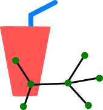

smoothG 
=================

<!-- BHEADER ++++++++++++++++++++++++++++++++++++++++++++++++++++++++++++++++++
 +
 + Copyright (c) 2018, Lawrence Livermore National Security, LLC.
 + Produced at the Lawrence Livermore National Laboratory.
 + LLNL-CODE-745247. All Rights reserved. See file COPYRIGHT for details.
 +
 + This file is part of smoothG. For more information and source code
 + availability, see https://www.github.com/llnl/smoothG.
 +
 + smoothG is free software; you can redistribute it and/or modify it under the
 + terms of the GNU Lesser General Public License (as published by the Free
 + Software Foundation) version 2.1 dated February 1999.
 +
 +++++++++++++++++++++++++++++++++++++++++++++++++++++++++++++++++++ EHEADER -->

Mixed graph-Laplacian upscaling and solvers.

For installation instructions, see [INSTALL.md](INSTALL.md).

For a tutorial walkthrough of the example code, see [EXAMPLE.md](doc/EXAMPLE.md).

This project is intended to take a graph and build a smaller (upscaled)
graph that is representative of the original in some way. We represent
the graph Laplacian in a mixed form, solve some local eigenvalue problems
to uncover near-nullspace modes, and use those modes as coarse degrees
of freedom.

This code is based largely on the following paper:

> A.T. Barker, C.S. Lee, and P.S. Vassilevski, Spectral upscaling for 
> graph Laplacian problems with application to reservoir simulation, *SIAM
> J. Sci. Comput.*, Vol. 39, No. 5, pp. S323–S346.

This code has contributions from:
- Andrew T. Barker (atb@llnl.gov)
- Stephan Gelever (gelever1@llnl.gov)
- Chak Shing Lee (cslee@llnl.gov)
- Colin Ponce (ponce11@llnl.gov)

Copyright (c) 2018, Lawrence Livermore National Security, LLC.
This work was performed under the auspices of the U.S. Department of Energy by
Lawrence Livermore National Laboratory under Contract DE-AC52-07NA27344.
LLNL-CODE-745247.
